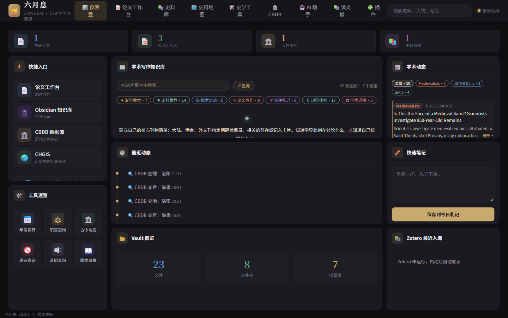
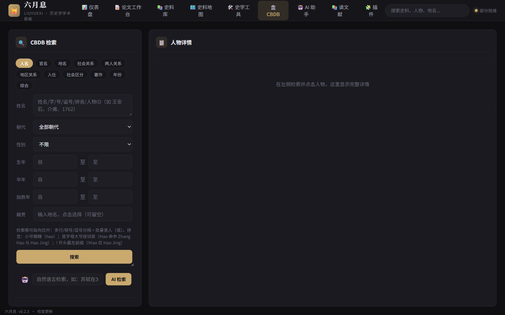
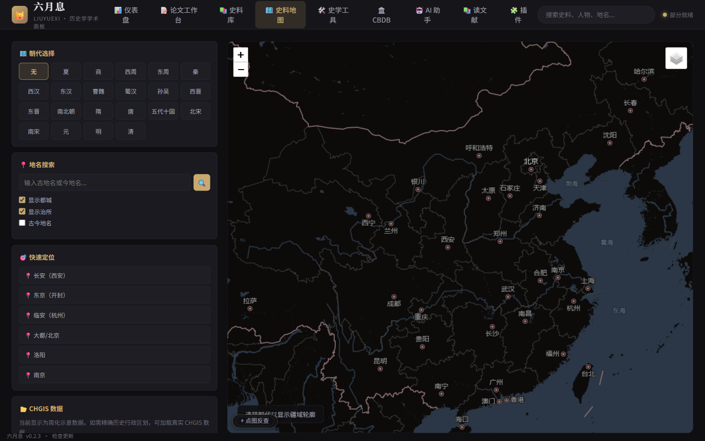
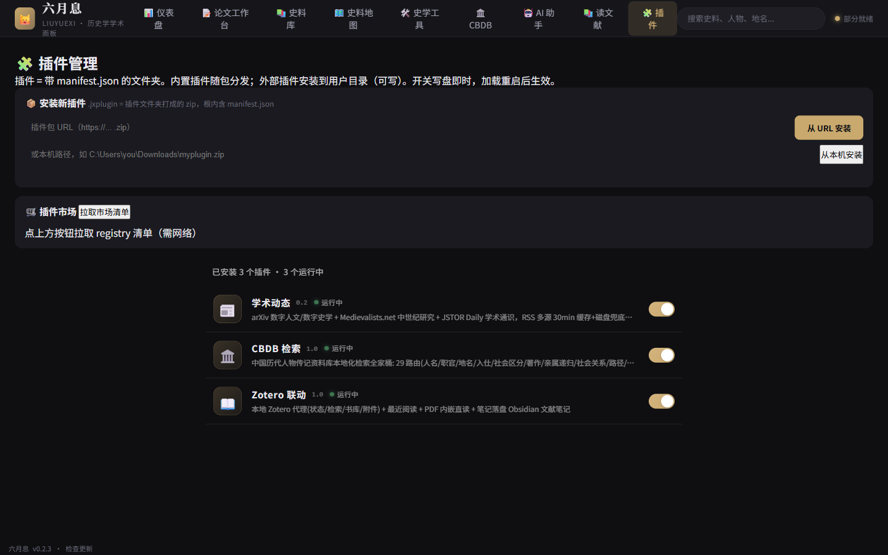

# 六月息 JuneXi

> 历史研究个人工作台：**史料的检索与联动枢纽**。
> 集成 CBDB 本地化检索、历史地图、Zotero 联动、Obsidian 笔记桥、
> 可插拔插件系统与多库联合检索——让分散的数字史学工具在一个界面里协同。

## 为什么是"枢纽"

Obsidian 与 Zotero 可以在其内部连接，CBDB 与地图、社会网络分析也可以在其内部连接。
六月息的推进只在于**降低连接的门槛**，并让每个使用者能按自己的研究领域自由装配——
像 Zotero 和 Obsidian 那样，以插件扩展，而非以框架约束。

## 界面预览

|仪表盘（工作台首页）|CBDB 检索（人物/职官/地名/社会关系 全家桶）|
|---|---|
|||

|史料地图（高德中文暗夜底图 + CHGIS 朝代图层）|插件管理（Zotero 式列表）|
|---|---|
|||

## 功能全景

| 模块 | 说明 |
|---|---|
| 🏛️ CBDB 检索 | 中国历代人物传记资料库（613MB 本地化）：人名/职官/地名/入仕/社会区分/著作/年份在世八大检索，亲属递归（五服标注）、社会关系、两人亲属路径 |
| 🗺️ 历史地图 | CHGIS 数据 + 高德中文底图：群体上地图、人生轨迹视图、点图反查 CBDB、生卒年↔朝代图层联动 |
| 📚 读文献 | Zotero 全库列表（73+ 条目）、内嵌 PDF 阅读器、边读边记直写 Obsidian |
| 📖 史料库 | 70 个精选数据库导航（按经史子集/出土文献/域外/期刊/古文字分类），库内检索，AI 导购 |
| 🔍 联合检索 | 一次输入多库并行：CBDB 本地计数、Kanripo 汉籍库、ctext、订阅库带词直达 |
| 🛠️ 史学工具 | 避讳/音韵/年号/职官/地名/版本目录六件，结果附来源声明与在线核查路径 |
| 🤖 AI 助手 | 多模型可选（DeepSeek 对话/深思、OpenClaw 网关），历史研究提示词库 17 条，荣新江《学术训练与学术规范》知识库注入 |
| 🧩 插件系统 | 插件 = `plugins/` 下的文件夹，管理页可视化开关，前端页面自动注入 |
| 📓 学术动态 | arXiv + PubMed 历史/人文/认知科学 RSS 聚合 |

## ⚠️ 安全说明（杀毒软件警告）

本软件**未购买代码签名证书**（年费数百美元），Windows SmartScreen / 360 等会对“网上下载 + 未知发布者”的程序弹警告，这是预期行为，**不是病毒**。

- 代码全部开源可自查；发布包用 PyInstaller 从仓库源码直接构建
- 若被杀软隔离，请对 JuneXi.exe 添加信任/白名单后重试
- 存疑请把 JuneXi.exe 上传 [virustotal.com](https://www.virustotal.com) 自查，或比对以下 SHA-256 指纹

## 快速开始（开发）

```bash
pip install -r requirements.txt   # Flask + pywebview + requests + sxtwl 等
python app.py                     # 默认 127.0.0.1:5000
```

桌面版（Windows）：`python -m PyInstaller -y JuneXi.spec` 产出 `dist/JuneXi/`。

## 数据依赖（不在仓库内）

- **CBDB** 数据集：从 [CBDB 官网](https://projects.iq.harvard.edu/cbdb/) 下载 Access 版，
  放至 `Documents/historia-data/cbdb/`（可用环境变量 `CBDB_DATA_PATH` 覆盖）
- **CHGIS** 数据：同目录 `chgis_data/`（V6 版）
- **Zotero**：需本地客户端运行并启用 local API（默认端口 23119）
- **Obsidian**：需 Local REST API 插件（端口 27123），或直接用文件系统模式
- **DeepSeek API**（可选）：`.env` 里 `DEEPSEEK_API_KEY=`，缺省时回退 OpenClaw 网关

## 测试

```bash
python _test_phase1.py   # CBDB 检索回归（14 项）
python _test_phase7.py   # 亲属递归（19 项）
# …共 9 个测试文件 109+ 项，全绿再合并
```

## 技术栈

Flask · pywebview（WebView2）· PyInstaller · Leaflet + 高德瓦片 · ECharts 力导向图 ·
sxtwl（天文历排盘也用它）· Access via pyodbc/win32com

## 作者与致谢

作者：Korm · 开发协作：Auto-Korm（AI 结对编程）

致谢：CBDB（哈佛燕京学社等）· CHGIS（哈佛燕京学社）· 中国哲学书电子化计划 ·
Kanripo 汉籍 Repository · 荣新江《学术训练与学术规范》（知识库内容来源）

## License

[MIT](LICENSE) — 自由使用、修改与再分发，保留署名即可。

---

*"去以六月息者也"——《庄子·逍遥游》*


## 发布包完整性

| 文件 | SHA-256 |
|---|---|
| JuneXi-v0.2.1-windows.zip（最新 Release） | `cf34a4377be65dc9bc99f2f322944dd1067bac45f5ce125f28b25d9bbb1942c7` |
| JuneXi.exe（含于 zip，v0.2.0 相同） | `d875f95d04e30a2a3b8a806f5130af88573119e776093da7920db503a6c748e4`（Windows Defender 2026-10-05 全量扫描无威胁） |
